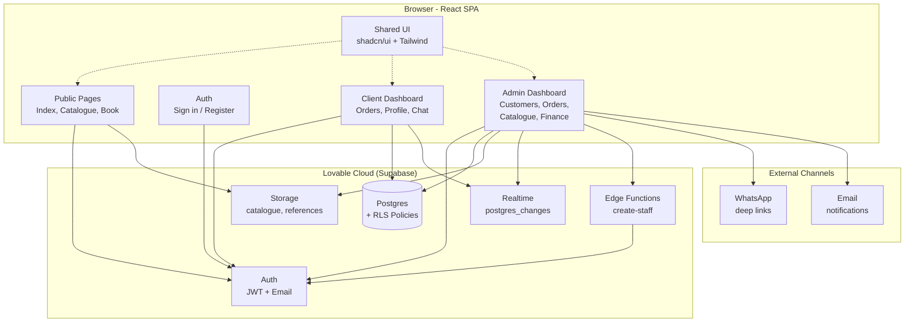
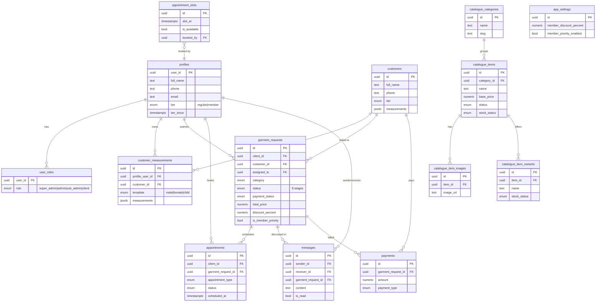
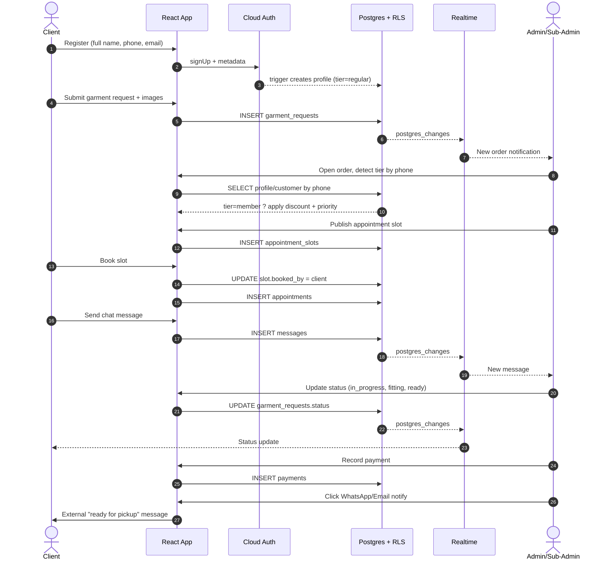
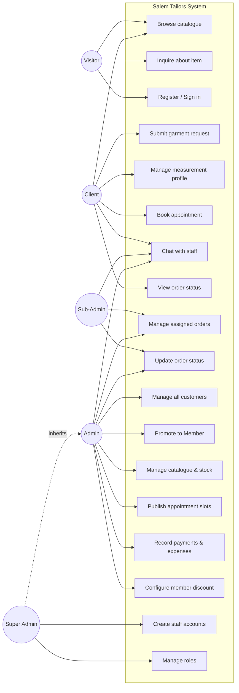

# Salem Tailors — Digital Shop Management System

A mobile-first, low-bandwidth optimized web platform that digitises the operations of **Salem Tailors** in Lusaka, Zambia. The system replaces manual paper records with a unified workflow covering customer registration, measurement profiles, order tracking, appointments, a public product catalogue, finance, and real-time client/staff messaging.

**Live URLs**
- Production: https://salemtailors.lovable.app
- Lovable Project: https://lovable.dev/projects/e92e2d92-99f1-4361-9b39-65a9e707e00f

---

## Table of Contents

1. [Tech Stack](#tech-stack)
2. [Key Features](#key-features)
3. [User Roles](#user-roles)
4. [Architecture (UML Component Diagram)](#architecture-uml-component-diagram)
5. [Database Schema (ERM Diagram)](#database-schema-erm-diagram)
6. [Key Workflow (Sequence Diagram)](#key-workflow-sequence-diagram)
7. [Use Cases](#use-cases)
8. [Local Development](#local-development)
9. [Project Structure](#project-structure)
10. [Deployment](#deployment)

---

## Tech Stack

| Layer            | Technology                                                  |
| ---------------- | ----------------------------------------------------------- |
| Frontend         | React 18, Vite 5, TypeScript 5                              |
| Styling          | Tailwind CSS v3 + shadcn/ui (semantic HSL design tokens)    |
| Routing / State  | react-router-dom v6, @tanstack/react-query                  |
| Forms / Validation | react-hook-form + Zod                                     |
| Backend (BaaS)   | Lovable Cloud (Supabase: Postgres, Auth, Storage, RLS, Edge Functions) |
| Realtime         | Supabase Realtime (Postgres changes for messages)           |
| Notifications    | Email + WhatsApp deep-links (manual click from admin)       |
| Hosting          | Lovable (auto-deploys on each change)                       |

---

## Key Features

### Public site
- Landing page with portfolio highlights and CTAs
- **Product Catalogue** — browse bags, caps, fabrics, and merchandise with images, variants (size/color), and stock status
- Catalogue item detail page with inquiry-by-chat or WhatsApp
- Booking page for first-time consultation requests

### Client dashboard
- Order request submission with reference images and preferences
- 8-stage order tracking (request → completed/ready for pickup)
- **Measurement profiles** with separate male / female / child templates
- Appointment self-booking against staff-published slots
- Real-time chat with assigned staff
- Tier badge (Regular / Member) with discount visibility

### Admin / Staff dashboard
- **Customer management** — search, filter by tier/source, CSV export, promote to Member
- **Orders** — auto-detects member tier by phone, applies member discount + priority badge
- **Catalogue management** — categories, items, variants, multi-image upload (Supabase Storage)
- **Appointments & Slots** — publish availability, confirm bookings
- **Finance** — payments, expenses, deposit/balance tracking
- **Portfolio** — featured work gallery
- **Staff Management** — Super Admin creates staff via Edge Function
- **Settings** — member discount %, notification email/WhatsApp number
- Real-time chat panel with all clients

### Cross-cutting
- Supabase RLS on every table, with `is_staff()` and `has_role()` security-definer functions
- Strict mobile-first responsive layout with overflow "More" sheet for staff nav
- Persistent back navigation across all dashboard routes

---

## User Roles

Four roles are stored in a separate `user_roles` table (never on `profiles`) to prevent privilege escalation:

| Role          | Capabilities                                                              |
| ------------- | ------------------------------------------------------------------------- |
| `super_admin` | Everything + create/remove staff accounts, manage roles                   |
| `admin`       | All operational features (customers, orders, catalogue, finance, settings) |
| `sub_admin`   | Sees only requests assigned to them; can chat and update status           |
| `client`      | Own profile, measurements, orders, appointments, chat                     |

Permission checks use the SQL function `has_role(_user_id, _role)` (SECURITY DEFINER) inside RLS policies to avoid recursion.

---

## Architecture (UML Component Diagram)



---

## Database Schema (ERM Diagram)



---

## Key Workflow (Sequence Diagram)

End-to-end flow from a client placing an order to staff fulfilment.



---

## Use Cases



---

## Local Development

Requirements: Node.js 18+ and npm (or bun).

```sh
# 1. Clone
git clone <YOUR_GIT_URL>
cd salem-tailors

# 2. Install
npm install        # or: bun install

# 3. Run dev server (Vite, port 8080)
npm run dev        # or: bun run dev
```

Environment variables (`.env`) are auto-managed by Lovable Cloud:
- `VITE_SUPABASE_URL`
- `VITE_SUPABASE_PUBLISHABLE_KEY`
- `VITE_SUPABASE_PROJECT_ID`

> **Do not edit** `.env`, `src/integrations/supabase/client.ts`, `src/integrations/supabase/types.ts`, or files under `supabase/migrations/`. They are regenerated automatically.

### Useful commands

```sh
npm run build       # production bundle
npm run lint        # ESLint
bunx vitest run     # run unit tests (src/test/)
```

---

## Project Structure

```
src/
├── components/
│   ├── DashboardLayout.tsx        # responsive nav + "More" sheet
│   ├── ProtectedRoute.tsx         # role-aware route guard
│   └── ui/                        # shadcn/ui primitives
├── hooks/
│   └── useAuth.tsx                # session + role hook
├── integrations/supabase/         # auto-generated client + types
├── lib/
│   ├── measurements.ts            # male/female/child templates
│   ├── csv-export.ts
│   └── supabase-helpers.ts
├── pages/
│   ├── Index.tsx                  # landing
│   ├── Auth.tsx                   # sign in / register (Zod)
│   ├── Catalogue.tsx              # public shop
│   ├── CatalogueItem.tsx          # product detail + inquiry
│   ├── Book.tsx                   # consultation booking
│   └── dashboard/
│       ├── ClientDashboard.tsx
│       ├── ClientProfile.tsx      # measurements
│       ├── ClientOrders.tsx
│       ├── ClientAppointments.tsx
│       ├── AdminDashboard.tsx
│       ├── AdminCustomers.tsx     # tier mgmt + CSV export
│       ├── AdminOrders.tsx        # auto member discount
│       ├── AdminCatalogue.tsx
│       ├── AdminAppointments.tsx
│       ├── AdminSlots.tsx
│       ├── AdminFinance.tsx
│       ├── AdminPortfolio.tsx
│       ├── StaffManagement.tsx    # super_admin only
│       ├── Settings.tsx
│       └── Messages.tsx           # realtime chat
└── index.css                      # HSL design tokens

supabase/
├── config.toml
├── migrations/                    # auto-generated
└── functions/
    └── create-staff/              # Edge Function for staff onboarding
```

---

## Deployment

The project is hosted on Lovable. To publish a new version, open the [Lovable project](https://lovable.dev/projects/e92e2d92-99f1-4361-9b39-65a9e707e00f) and click **Share → Publish**. Edge functions and database migrations are deployed automatically.

To attach a custom domain, go to **Project → Settings → Domains → Connect Domain**.

---

## Security Notes

- Roles are stored only in `user_roles` and validated server-side via `has_role()` SECURITY DEFINER functions.
- Every table has RLS enabled; clients can only read/write their own rows, staff are gated by `is_staff()`.
- Storage bucket `catalogue` is public-read, staff-write.
- Authentication uses email + password (no anonymous sign-ups). Email verification is required by default.
